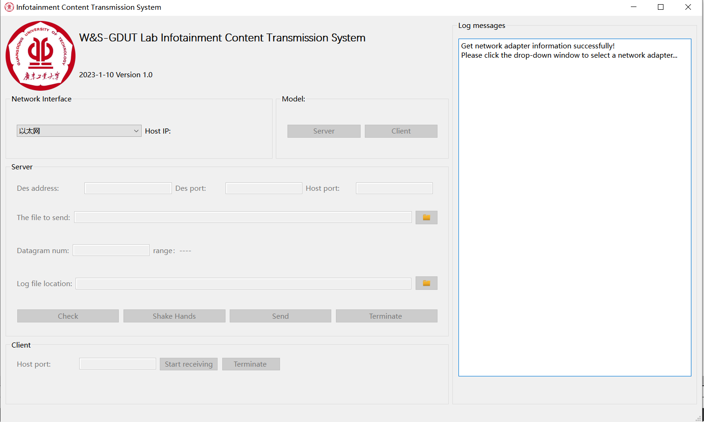

该仓库描述一个Qt项目，使用C++实现UDP Socket通信，实现OBU与RSU间的数据传输，通过Qt界面实时显示传输速率、延迟和数据丢失率等数据传输过程中的各项性能指标。

## 环境
- Qt 6.5.3
- C++11

## 功能描述
- UDP套接字通信
- 服务器端发送文件
- 客户端接收文件

<!-- ## 文件
- `transmissionwindow.h`：自定义的窗口类 TransmissionWindow 的头文件。
- `transmissionwindow.cpp`：

### 头文件
- `QApplication`：Qt应用程序框架的核心类，用于管理应用程序的全局设置和主事件循环。

### main.cpp 
-  -->

